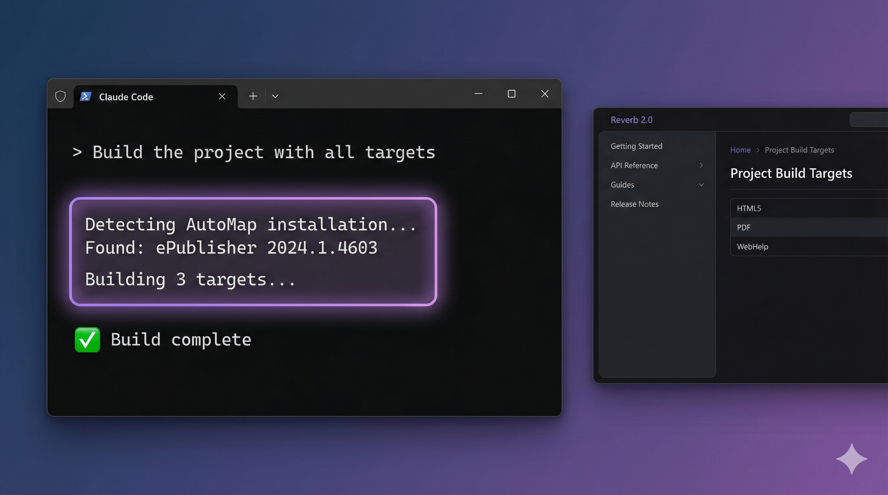

# WebWorks Claude Skills

[](https://opensource.org/licenses/MIT)
[](https://www.microsoft.com/windows)
[](https://claude.ai/code)
[](https://www.webworks.com)

AI-powered automation for WebWorks ePublisher—publish, test, and customize your documentation with natural language.



## 🎯 What is This?

WebWorks Claude Skills is a collection of Claude Code skills that bring AI assistance to WebWorks ePublisher workflows. Ask Claude to publish your projects, analyze output, customize themes, and more—all through natural conversation.

## ✨ Quick Start (2 Minutes)

In Claude Code:

```
/plugin marketplace add quadralay/webworks-claude-skills
/plugin install epublisher-automation@webworks-claude-skills
```

That's it! Skills activate automatically when working with ePublisher projects.

> **Note:** Claude Desktop is not yet supported.

## 🚀 Available Skills

- 📚 **epublisher** - Core ePublisher knowledge, project structure, file resolver hierarchy
- 🔨 **automap** - Publishing automation with AutoMap CLI
- 🧪 **reverb** - Reverb 2.0 testing, CSH analysis, SCSS theming

## 🎮 Example Workflows

### Technical Writer

```
You: "Publish the project with all targets"
Claude: Detects AutoMap, constructs command, publishes output, reports results

You: "What targets are configured?"
Claude: Parses project file, lists all targets with their output formats

You: "Test the Reverb output for JavaScript errors"
Claude: Launches browser, checks console, reports any issues
```

### Documentation Designer

```
You: "Extract the color variables from this Reverb theme"
Claude: Parses SCSS, lists all color variables with current values

You: "Generate overrides to change the primary color to #2563eb"
Claude: Creates SCSS override file with proper variable mappings

You: "Check if the CSH links are working"
Claude: Analyzes all context-sensitive help links, reports broken ones
```

## 💡 Why WebWorks Claude Skills?

### Traditional Approach
```
1. Open command prompt
2. Navigate to AutoMap directory
3. Remember correct syntax and parameters
4. Manually check output for errors
5. Open browser DevTools to debug issues
```

### With WebWorks Claude Skills
```
You: "Publish the project and check for errors"
Claude: Handles everything, reports results
```

**WebWorks Claude Skills provides:**
- ✅ Natural language control of ePublisher workflows
- ✅ Automatic tool detection and configuration
- ✅ Intelligent error detection and reporting
- ✅ Theme customization without manual SCSS editing

## 🔧 Requirements

**Required:**
- **Windows** (ePublisher is Windows-only)
- **[Git for Windows](https://git-scm.com/download/win)** (provides Git Bash for automation scripts)
- **[WebWorks ePublisher 2024.1+](https://webworks.com/products/epublisher/download#download-links)** (Express required; Designer optional)
- **[WebWorks AutoMap](https://webworks.com/products/epublisher/download#download-links)** (highly recommended for full automation)
- **Claude Code** installed and configured

> **Note:** Legacy ePublisher 2020.2+ is supported but 2024.1+ is recommended. WSL is not supported.

## 📂 Repository Structure

```
webworks-claude-skills/
├── .claude-plugin/
│   └── marketplace.json         # Marketplace manifest
├── plugins/
│   └── epublisher-automation/   # Main plugin
│       └── skills/
│           ├── epublisher/      # Core knowledge
│           ├── automap/         # Publishing automation
│           └── reverb/          # Output testing
├── plans/                       # Development plans
├── CONTRIBUTING.md
└── README.md
```

## 📚 Documentation

### Skills
- **[epublisher/SKILL.md](plugins/epublisher-automation/skills/epublisher/SKILL.md)** - Core ePublisher knowledge
- **[automap/SKILL.md](plugins/epublisher-automation/skills/automap/SKILL.md)** - Publishing automation
- **[reverb/SKILL.md](plugins/epublisher-automation/skills/reverb/SKILL.md)** - Reverb 2.0 testing

### Development
- **[CONTRIBUTING.md](CONTRIBUTING.md)** - Contribution guidelines
- **plans/** - Development plans (historical)

## 🤝 Contributing

We welcome contributions! See [CONTRIBUTING.md](CONTRIBUTING.md) for guidelines.

**Priority areas:**
- Enhancing existing skills
- Adding new design skills for Reverb
- Adding design skills for other output formats
- Adding content generation skills

## 📄 License

This project is licensed under the MIT License - see the [LICENSE](LICENSE) file for details.

---

**Automate your documentation workflow with the power of AI.**

🛠️ Built for [WebWorks ePublisher](https://www.webworks.com) | 🤖 Powered by [Claude Code](https://claude.ai/code)
