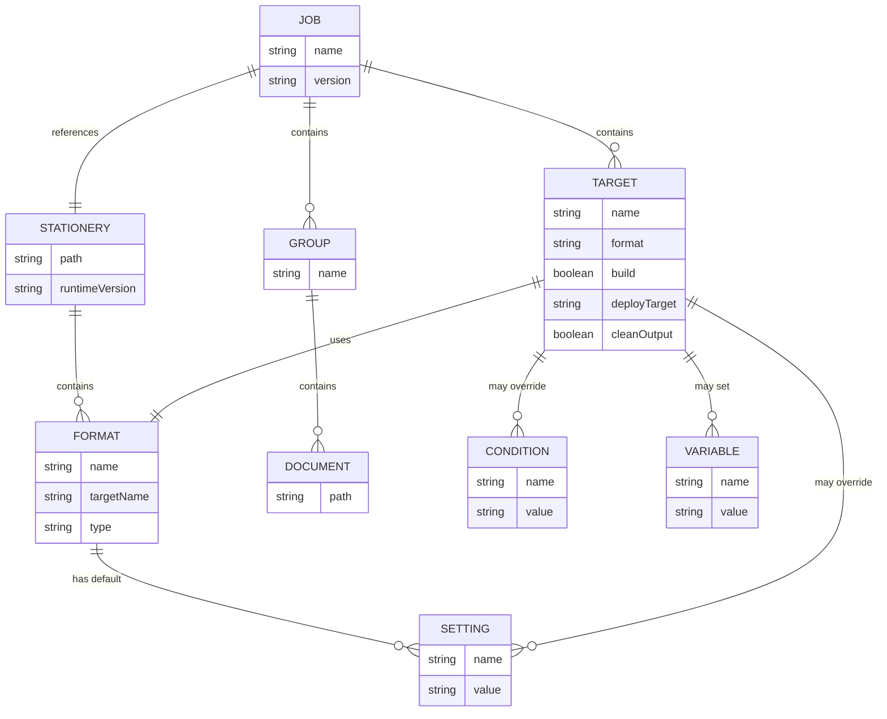

# feat: Add AutoMap Job File Creation Skill

## Overview

Create a skill that enables users to **generate AutoMap Job files (.waj) from scratch** through an interactive workflow. Users provide a Stationery file, source documents, and target configuration - the skill generates valid job file XML.

### Why This Matters

Currently, users must:
1. Open AutoMap Administrator GUI to create job files, OR
2. Manually write XML by hand (error-prone)

This skill provides a **conversational alternative** that:
- Parses Stationery to show available formats and settings
- Guides users through document organization
- Validates input as it's collected
- Generates correct XML automatically

---

## Problem Statement

Creating AutoMap Job files requires:
1. Understanding job file XML structure
2. Knowing what formats/settings are available in the Stationery
3. Organizing source documents into groups
4. Configuring targets with correct attribute names and values

**Pain points:**
- No command-line tool for job creation
- Manual XML editing is tedious and error-prone
- Must remember exact format names (case-sensitive)
- No validation until build time

---

## Proposed Solution

A two-part implementation:

### Part 1: Job File Creation Workflow (Primary)

An interactive workflow that:
1. Parses Stationery to extract available formats and settings
2. Guides users through source document organization
3. Configures targets with overrides
4. Generates and validates job file XML

### Part 2: Job File Utilities (Supporting)

Scripts for working with existing job files:
- `parse-job.py` - Extract configuration from existing jobs
- `validate-job.py` - Validate job files before building
- `list-job-targets.py` - List targets with build status

---

## Technical Approach

### Architecture

```
┌─────────────────────────────────────────────────────────────────┐
│                    automap skill                                 │
├─────────────────────────────────────────────────────────────────┤
│  SKILL.md (updated)                                              │
│  ├── Job file creation workflow                                 │
│  ├── Stationery parsing for available formats                   │
│  └── Interactive configuration guidance                         │
├─────────────────────────────────────────────────────────────────┤
│  references/                                                     │
│  └── job-file-guide.md (NEW)                                    │
│      ├── XML structure reference                                │
│      ├── Element/attribute tables                               │
│      └── Creation workflow examples                             │
├─────────────────────────────────────────────────────────────────┤
│  scripts/                                                        │
│  ├── parse-stationery.py (NEW) - Extract formats/settings      │
│  ├── create-job.py (NEW) - Generate job file XML               │
│  ├── parse-job.py (NEW) - Parse existing job files             │
│  ├── validate-job.py (NEW) - Validate job files                │
│  └── list-job-targets.py (NEW) - List targets                  │
└─────────────────────────────────────────────────────────────────┘
```

### Information Flow

```
┌──────────────┐     ┌──────────────────┐     ┌─────────────────┐
│  Stationery  │────▶│ parse-stationery │────▶│ Available:      │
│   (.wxsp)    │     │      .py         │     │ - Formats       │
└──────────────┘     └──────────────────┘     │ - Settings      │
                                              │ - File types    │
                                              └────────┬────────┘
                                                       │
┌──────────────┐                                       ▼
│ User Input:  │     ┌──────────────────┐     ┌─────────────────┐
│ - Job name   │────▶│   create-job     │────▶│   Job File      │
│ - Documents  │     │      .py         │     │    (.waj)       │
│ - Targets    │     └──────────────────┘     └─────────────────┘
│ - Overrides  │
└──────────────┘
```

### What We Can Extract from Stationery

| Information | Stationery Element | Use in Job Creation |
|------------|-------------------|---------------------|
| Format names | `<Format Name="...">` | Target `format` attribute |
| Target names | `<Format TargetName="...">` | Target `name` attribute |
| Format types | `<Format Type="...">` | Target `formatType` attribute |
| Settings | `<FormatSetting Name="..." Value="...">` | Setting override options |
| File mappings | `<FileMapping extension="...">` | Document validation |
| Runtime version | `<Project RuntimeVersion="...">` | Compatibility info |

### What Users Must Provide

| Information | Job Element | How to Gather |
|------------|------------|---------------|
| Job name | `<Job name="...">` | Prompt user |
| Stationery path | `<Project path="...">` | File path input |
| Source documents | `<Files><Group><Document>` | Iterative collection |
| Group organization | `<Group name="...">` | User-defined grouping |
| Target selection | `<Target>` | Choose from Stationery formats |
| Build flags | `build`, `cleanOutput` | Yes/No prompts |
| Deploy target | `deployTarget` | Optional input |
| Conditions | `<Conditions><Condition>` | User-defined key-value |
| Variables | `<Variables><Variable>` | User-defined key-value |
| Settings | `<Settings><Setting>` | Choose from available, set value |

---

## Interactive Workflow Design

### Phase 1: Parse Stationery

```
User: "I want to create a job file"

Claude: I'll help you create an AutoMap job file. First, I need the
        Stationery file that defines your output formats.

        What is the path to your Stationery (.wxsp) file?

User: C:\Projects\help\stationery\main.wxsp

Claude: [Parses stationery]

        Found Stationery: main.wxsp

        Available Formats:
        ┌─────────────────────────┬─────────────┬─────────────────────┐
        │ Format Name             │ Type        │ Target Name         │
        ├─────────────────────────┼─────────────┼─────────────────────┤
        │ WebWorks Reverb 2.0     │ Application │ WebWorks Reverb 2.0 │
        │ PDF - XSL-FO            │ Document    │ PDF Output          │
        └─────────────────────────┴─────────────┴─────────────────────┘

        Available Settings (per format):
        - locale (default: "en")
        - show-first-document (default: "true")
        - header-generate (default: "true")

        Supported File Types: .md, .docx, .fm, .xml, .dita
```

### Phase 2: Configure Job

```
Claude: What name would you like for this job?
        (This identifies the job, e.g., "en" for English locale)

User: help-en

Claude: Job name: help-en

        Now let's add source documents. I'll help you organize them into groups.
```

### Phase 3: Collect Source Documents (Iterative)

```
Claude: What should the first group be named?
        (Groups organize documents, e.g., "Introduction", "Reference")

User: Getting Started

Claude: Group: "Getting Started"

        Add documents to this group. Enter paths relative to the job file location.
        (Enter blank line when done with this group)

User: Source\en\intro.md
      Source\en\installation.md
      Source\en\quickstart.md
      [blank]

Claude: Group "Getting Started" has 3 documents:
        - Source\en\intro.md
        - Source\en\installation.md
        - Source\en\quickstart.md

        Add another group? (y/n)

User: y

Claude: What should the next group be named?

User: Reference

[...continues until user enters 'n'...]
```

### Phase 4: Configure Targets

```
Claude: Now let's configure build targets.

        Available formats from Stationery:
        1. WebWorks Reverb 2.0 (Application)
        2. PDF - XSL-FO (Document)

        Which format for the first target? (enter number or name)

User: 1

Claude: Target: WebWorks Reverb 2.0

        Build this target by default? (y/n): y
        Clean output before build? (y/n): n
        Deploy target name (blank for none): Production Help

        Configure overrides for this target?
        - Conditions (conditional content processing)
        - Variables (document variables)
        - Settings (format settings)

        Add overrides? (c=conditions, v=variables, s=settings, n=none)

User: s

Claude: Available settings:
        - locale (current: "en")
        - show-first-document (current: "true")
        - header-generate (current: "true")

        Setting to override (blank when done):

User: locale

Claude: Value for 'locale':

User: en-US

Claude: Setting 'locale' = "en-US"

        Setting to override (blank when done):

User: [blank]

Claude: Add another target? (y/n)

User: n
```

### Phase 5: Preview and Generate

```
Claude: Here's your job file configuration:

        ══════════════════════════════════════════════════════
        Job: help-en (version 1.0)
        Stationery: ..\stationery\main.wxsp
        ══════════════════════════════════════════════════════

        Source Documents (2 groups, 5 documents):

          Getting Started/
            - Source\en\intro.md
            - Source\en\installation.md
            - Source\en\quickstart.md

          Reference/
            - Source\en\api.md
            - Source\en\troubleshooting.md

        Targets (1):

          [BUILD] WebWorks Reverb 2.0
                  Deploy: Production Help
                  Settings: locale="en-US"

        ══════════════════════════════════════════════════════

        Preview XML? (y/n)

User: y

Claude: <?xml version="1.0" encoding="utf-8"?>
        <Job name="help-en" version="1.0">
          <Project path="..\stationery\main.wxsp" />
          <Files>
            <Group name="Getting Started">
              <Document path="Source\en\intro.md" />
              <Document path="Source\en\installation.md" />
              <Document path="Source\en\quickstart.md" />
            </Group>
            <Group name="Reference">
              <Document path="Source\en\api.md" />
              <Document path="Source\en\troubleshooting.md" />
            </Group>
          </Files>
          <Targets>
            <Target name="WebWorks Reverb 2.0"
                    format="WebWorks Reverb 2.0"
                    formatType="Application"
                    build="True"
                    deployTarget="Production Help"
                    cleanOutput="False">
              <Settings>
                <Setting name="locale" value="en-US" />
              </Settings>
            </Target>
          </Targets>
        </Job>

        Generate file? (y=generate, e=edit, c=cancel)

User: y

Claude: Where should I save the job file?
        (Default: C:\Projects\help\help-en.waj)

User: [blank]

Claude: Created: C:\Projects\help\help-en.waj

        Next steps:
        - Validate: python validate-job.py help-en.waj
        - Build: automap-wrapper.sh help-en.waj
        - Edit: Open in AutoMap Administrator for GUI editing
```

---

## Implementation Phases

### Phase 1: Stationery Parser Script

**Deliverable**: `scripts/parse-stationery.py`

**Purpose**: Extract available formats, settings, and file mappings from Stationery

**CLI Interface**:
```bash
# Human-readable output
python parse-stationery.py stationery.wxsp

# JSON output for programmatic use
python parse-stationery.py --json stationery.wxsp
```

**Output Structure**:
```json
{
  "path": "C:\\Projects\\stationery\\main.wxsp",
  "runtimeVersion": "2024.1",
  "formats": [
    {
      "name": "WebWorks Reverb 2.0",
      "targetName": "WebWorks Reverb 2.0",
      "type": "Application",
      "targetId": "abc123",
      "settings": [
        {"name": "locale", "defaultValue": "en"},
        {"name": "show-first-document", "defaultValue": "true"}
      ]
    }
  ],
  "fileMappings": [
    {"extension": ".md", "adapter": "Helper Adapter"},
    {"extension": ".docx", "adapter": "Microsoft Word"}
  ]
}
```

**Implementation Pattern**: Follow `plugins/epublisher-automation/skills/epublisher/scripts/parse-targets.py`

---

### Phase 2: Job Creator Script

**Deliverable**: `scripts/create-job.py`

**Purpose**: Generate job file XML from structured input

**Two Modes**:

1. **Interactive Mode** (default):
```bash
python create-job.py --stationery path/to/stationery.wxsp
```
Prompts user for all configuration interactively.

2. **Config File Mode**:
```bash
python create-job.py --config job-config.json --output job.waj
```
Reads configuration from JSON file (useful for scripting/automation).

**Config File Format**:
```json
{
  "name": "help-en",
  "stationery": "..\\stationery\\main.wxsp",
  "groups": [
    {
      "name": "Getting Started",
      "documents": [
        "Source\\en\\intro.md",
        "Source\\en\\installation.md"
      ]
    }
  ],
  "targets": [
    {
      "name": "WebWorks Reverb 2.0",
      "format": "WebWorks Reverb 2.0",
      "formatType": "Application",
      "build": true,
      "cleanOutput": false,
      "deployTarget": "Production Help",
      "settings": [
        {"name": "locale", "value": "en-US"}
      ]
    }
  ]
}
```

**XML Generation**: Use `xml.etree.ElementTree` to build DOM, then pretty-print.

---

### Phase 3: Job Utility Scripts

#### parse-job.py

**Purpose**: Extract configuration from existing job files

**Use Cases**:
- Understand existing job structure
- Export to JSON for modification
- Validate job was created correctly

```bash
python parse-job.py job.waj
python parse-job.py --json job.waj > job-config.json
```

#### validate-job.py

**Purpose**: Validate job file before building

**Validation Checks**:
1. XML well-formedness
2. Required elements present
3. Stationery path resolves
4. Format names valid (optional: cross-check with Stationery)
5. Document paths well-formed

```bash
python validate-job.py job.waj
python validate-job.py --check-stationery job.waj
```

#### list-job-targets.py

**Purpose**: Quick view of targets and build status

```bash
python list-job-targets.py job.waj
python list-job-targets.py --enabled job.waj
```

---

### Phase 4: SKILL.md Integration

**Update SKILL.md** to include:

1. **Job File Creation Section**:
```markdown
<job_creation>

## Creating Job Files

### Interactive Creation

To create a job file from scratch:

1. Identify your Stationery file (.wxsp)
2. Gather your source documents
3. Decide which formats to build

The skill will guide you through:
- Parsing Stationery to show available formats
- Organizing documents into groups
- Configuring targets with overrides
- Generating valid XML

### Using Scripts

```bash
# Parse Stationery to see available formats
python scripts/parse-stationery.py stationery.wxsp

# Create job interactively
python scripts/create-job.py --stationery stationery.wxsp

# Create job from config file
python scripts/create-job.py --config config.json --output job.waj
```

</job_creation>
```

2. **Workflow Section** with step-by-step guidance

3. **Troubleshooting** for creation errors

---

### Phase 5: Reference Documentation

**Deliverable**: `references/job-file-guide.md` (400-600 lines)

**Content**:

1. **Job File Overview**
   - Purpose and use cases
   - Comparison with project files
   - Stationery inheritance model

2. **XML Structure Reference**
   - All elements with attributes
   - Required vs optional elements
   - Attribute value formats

3. **Creation Workflow**
   - Step-by-step instructions
   - Interactive vs scripted creation
   - Best practices

4. **Target Configuration**
   - Conditions (conditional content)
   - Variables (document variables)
   - Settings (format overrides)

5. **Examples**
   - Minimal job file
   - Multi-target with overrides
   - Multi-locale pattern

6. **Troubleshooting**
   - Common creation errors
   - Validation failures
   - Build-time issues

---

## User Interaction Patterns

### Gathering Hierarchical Data (Groups → Documents)

```python
def collect_groups():
    groups = []
    while True:
        group_name = prompt("Group name (blank to finish):")
        if not group_name:
            break

        documents = []
        while True:
            doc_path = prompt(f"  Document for '{group_name}' (blank to finish):")
            if not doc_path:
                break
            # Validate path format
            if validate_path(doc_path):
                documents.append(doc_path)
            else:
                print(f"  Warning: Invalid path format: {doc_path}")

        groups.append({"name": group_name, "documents": documents})
        print(f"  Added group '{group_name}' with {len(documents)} documents")

    return groups
```

### Presenting Choices from Stationery

```python
def select_format(stationery_data):
    formats = stationery_data["formats"]

    print("\nAvailable formats:")
    for i, fmt in enumerate(formats, 1):
        print(f"  {i}. {fmt['name']} ({fmt['type']})")

    while True:
        choice = prompt("Select format (number or name):")

        # Try as number
        if choice.isdigit():
            idx = int(choice) - 1
            if 0 <= idx < len(formats):
                return formats[idx]

        # Try as name
        for fmt in formats:
            if fmt["name"].lower() == choice.lower():
                return fmt

        print("Invalid selection. Try again.")
```

### Preview Before Generation

```python
def preview_and_confirm(job_config):
    # Show human-readable summary
    print_summary(job_config)

    # Ask about XML preview
    if confirm("Preview XML?"):
        xml_str = generate_xml(job_config)
        print(xml_str)

    # Confirm generation
    choice = prompt("Generate file? (y=generate, e=edit, c=cancel):")

    if choice == 'y':
        return "generate"
    elif choice == 'e':
        return "edit"
    else:
        return "cancel"
```

---

## Acceptance Criteria

### Functional Requirements

- [ ] `parse-stationery.py` extracts formats, settings, and file mappings
- [ ] `create-job.py` generates valid job file XML
- [ ] Interactive mode guides users through all configuration
- [ ] Config file mode supports scripted creation
- [ ] Generated XML validates against AutoMap expectations
- [ ] All scripts follow existing conventions (exit codes, logging)

### User Experience Requirements

- [ ] Clear prompts with examples
- [ ] Validation at each step (not just at the end)
- [ ] Preview before file generation
- [ ] Ability to edit/cancel at confirmation
- [ ] Helpful error messages

### Documentation Requirements

- [ ] SKILL.md updated with creation workflow
- [ ] `job-file-guide.md` complete
- [ ] Examples tested and working

---

## Dependencies & Prerequisites

**Required**:
- Python 3.x with standard library (`xml.etree.ElementTree`, `argparse`, `json`)
- Access to sample Stationery files for testing
- Understanding of job file XML structure

**Optional** (for enhanced interactive experience):
- `typer` library for richer prompts
- `rich` library for formatted output

---

## Risk Analysis & Mitigation

| Risk | Likelihood | Impact | Mitigation |
|------|------------|--------|------------|
| Stationery parsing incomplete | Medium | High | Test with multiple Stationery files |
| Path handling cross-platform | Medium | Medium | Use pathlib, document Windows focus |
| User input validation gaps | Medium | Medium | Validate early and often |
| XML generation encoding issues | Low | High | Use ElementTree (not string concat) |

---

## Open Questions

### Must Answer

1. **Stationery Namespace**: Does Stationery use `urn:WebWorks-Publish-Project` namespace like project files?
   - **Action**: Test with `parse-stationery.py` development

2. **Settings Extraction**: Can we get available settings from `<FormatConfiguration><FormatSettings>`?
   - **Action**: Confirm with sample Stationery parsing

3. **Conditions/Variables**: These aren't in Stationery - are there common patterns to suggest?
   - **Action**: Document common condition names (OnlineOnly, PrintOnly, etc.)

### Nice-to-Have

4. **Validation against Stationery**: Should we validate format names exist?
   - **Assumption**: Yes, warn if format not found

5. **Document existence check**: Should we verify documents exist?
   - **Assumption**: Warn but allow (documents may be generated)

---

## Success Metrics

After implementation, users should be able to:

1. **Create a simple job file in < 2 minutes** (interactive mode)
2. **Understand available formats** without opening Designer
3. **Avoid XML syntax errors** through generation
4. **Validate job files** before build attempts
5. **Modify existing jobs** by parsing and regenerating

---

## References

### Internal

- `plugins/epublisher-automation/skills/epublisher/scripts/parse-targets.py` - XML parsing pattern
- `plugins/epublisher-automation/skills/automap/SKILL.md` - Current skill structure
- `plans/automap-job-files-plan-prompt.md` - Original job file research

### External

- [AutoMap Overview](https://static.webworks.com/docs/epublisher/latest/help/ePublisher%20Interface/Automating%20Projects.4.01.html)
- [Scripting Variables](https://static.webworks.com/docs/epublisher/latest/help/ePublisher%20Interface/Automating%20Projects.4.35.html)

### Research Documents Created

- `plans/interactive-workflow-research.md` - Best practices for interactive CLI
- `plans/job-file-workflow-quick-guide.md` - Condensed workflow guide

---

## ERD: Job File Structure



---

## Summary

This plan creates an **AutoMap Job File Creation Skill** that:

1. **Parses Stationery** to show users what formats and settings are available
2. **Guides users interactively** through document organization and target configuration
3. **Generates valid XML** avoiding manual editing errors
4. **Validates configuration** before writing files
5. **Supports scripted creation** via config files for automation

The implementation prioritizes **user experience** - making job file creation accessible to users who aren't comfortable with XML editing, while providing utilities for those who work with existing job files.
